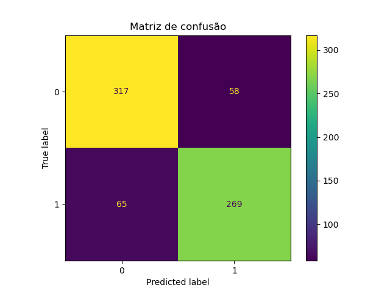

<h1 align="center">
    Aprendizado de máquinas
</h1>

<h2 align="center">
    Classificação de imagens
</h2>

## Personagens

- Krusty the clown
- Ned Flanders

## Características utilizadas

### Krusty

- Cabelo verde
- Camiseta roxa
- Rosto com pintura branca

### Ned

- Cabelo marron
- Blusão verde
- Calça cinza

## Matriz de confusão

